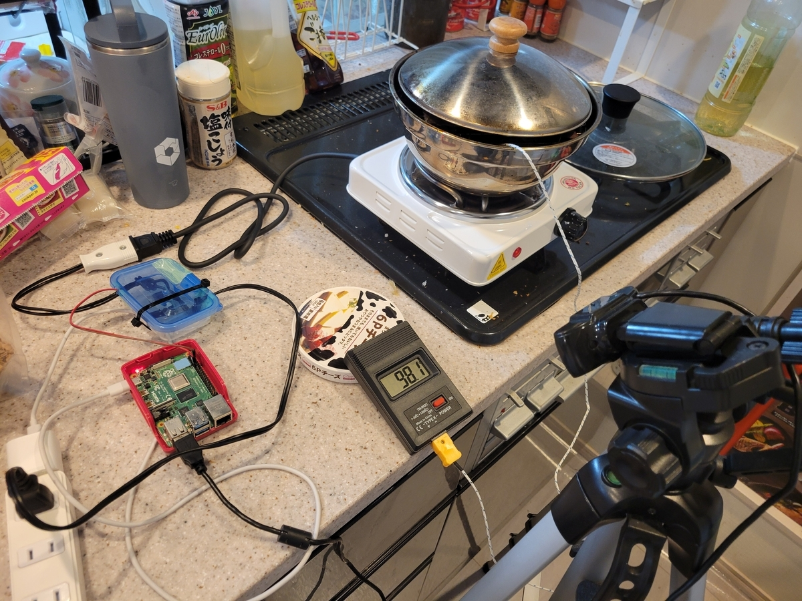

# Kunsei Creator

Webカメラで温度計を撮影し、VLM（Vision Language Model）で温度を読み取り、Raspberry PiのGPIOで電気コンロを制御するMCPサーバーシステムです。

## 概要

このプロジェクトは、料理の自動温度管理を実現するためのシステムです。以下の機能を提供します：

- Webカメラでデジタル温度計を撮影
- OpenAI VLMで温度計の数値を自動読み取り
- Raspberry PiのGPIO経由で電気コンロのON/OFF制御
- MCPサーバーとして動作し、外部から制御可能

## システムイメージ



## 機能

### MCPツール

1. **get_pot_temperature(sensor_id: str) -> float**
   - Webカメラで温度計を撮影し、VLMで解析して温度を返す
   - 戻り値: 温度（摂氏）、エラー時は -1.0

2. **turn_on_stove(stove_id: int) -> str**
   - 指定したIDの電気コンロをONにする
   - GPIO 17番ピンをHIGHに設定

3. **turn_off_stove(stove_id: int) -> str**
   - 指定したIDの電気コンロをOFFにする
   - GPIO 17番ピンをLOWに設定

## 必要な環境

### ハードウェア
- Raspberry Pi（GPIO対応モデル）
- Webカメラ（USB接続）
- デジタル温度計
- 電気コンロ（リレー経由で制御）
- リレーモジュール（GPIO 17番ピンに接続）

### ソフトウェア
- Python 3.11以上
- uv（Pythonパッケージマネージャー）

## セットアップ

### 1. リポジトリのクローン

```bash
git clone <repository-url>
cd kunsei-creator
```

### 2. 依存関係のインストール

```bash
uv sync
```

### 3. 環境変数の設定

`.env` ファイルを作成し、以下の環境変数を設定します：

```bash
# 必須
OPENAI_API_KEY=your_openai_api_key_here

# オプション（デフォルト値が設定されています）
MODEL_NAME=gpt-4o-mini
IMAGE_PATH=captured_image_latest.jpg
```

### 4. GPIO設定

GPIO 17番ピンにリレーモジュールを接続してください。

配線例：
- GPIO 17 → リレーIN
- GND → リレーGND
- 5V → リレーVCC（リレーモジュールによる）

## 使い方

### MCPサーバーとして起動

```bash
uv run python mcp_server.py
```

サーバーは `0.0.0.0:8000` で起動し、SSE（Server-Sent Events）トランスポートを使用します。

### 個別モジュールのテスト

#### Webカメラのテスト
```bash
uv run python webcam_testing.py
```
リアルタイムでカメラ映像を表示します。'q'またはESCキーで終了。

#### 画像キャプチャのテスト
```bash
uv run python capture.py
```
1枚の静止画を撮影し、`captured/` フォルダーに保存します。

#### VLM解析のテスト
```bash
uv run python vlm.py
```
保存済みの画像から温度計の値を読み取ります。

## ファイル構成

```
kunsei-creator/
├── mcp_server.py          # MCPサーバー本体
├── capture.py             # Webカメラキャプチャモジュール
├── vlm.py                 # VLM温度計解析モジュール
├── webcam_testing.py      # Webカメラテスト用スクリプト
├── pyproject.toml         # プロジェクト設定・依存関係
├── README.md              # このファイル
└── captured/              # キャプチャ画像の保存先（自動作成）
    ├── YYYY-MM-DD-HH-MM-SS.jpg  # タイムスタンプ付き画像
    └── captured_image_latest.jpg # 最新の画像
```

## 技術スタック

- **MCP**: FastMCP（Model Context Protocol サーバー）
- **VLM**: OpenAI GPT-4o-mini（画像解析）
- **画像処理**: OpenCV（Webカメラ制御）
- **GPIO制御**: gpiozero（Raspberry Pi GPIO）
- **AI統合**: LangChain + MCP Adapters

## VLM解析の仕組み

温度計の読み取りには厳格な検証ロジックを採用しています：

1. デジタル表示エリアの検出
2. 数値の厳密な読み取り（3回実施）
3. raw_digitsとtemp値の整合性チェック
4. 現実的な温度範囲チェック（-30°C〜200°C）
5. 不一致がある場合は`readable=false`を返す

## トラブルシューティング

### カメラが開けない
- カメラが他のアプリで使用されていないか確認
- カメラのデバイス番号を確認（`capture.py`の`cv2.VideoCapture(0)`の引数）

### GPIO制御ができない
- Raspberry Piで実行しているか確認
- GPIO権限があるか確認（必要に応じて`sudo`で実行）
- ピン番号が正しいか確認（BCMモード: GPIO 17）

### 温度が読み取れない
- 温度計がカメラの視野内にあるか確認
- 照明が十分か確認
- `webcam_testing.py`でカメラ映像を確認
- OpenAI APIキーが正しく設定されているか確認

### MCPサーバーが起動しない
- 環境変数が正しく設定されているか確認
- ポート8000が使用可能か確認
- 依存関係が正しくインストールされているか確認

## ライセンス

このプロジェクトのライセンスについては、プロジェクトオーナーに確認してください。

## 注意事項

- 電気コンロの制御には十分注意してください
- 火災や事故を防ぐため、システムの動作を常に監視してください
- 本番環境での使用前に、必ず十分なテストを実施してください
